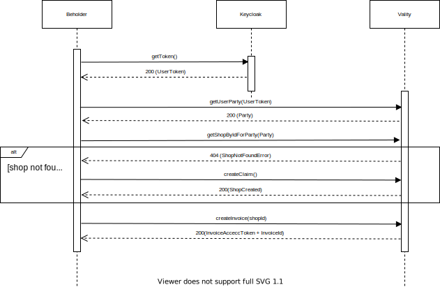

# beholder

Сервис собирает метрики о производительности загрузки платёжной формы из разных регионов.

## Особенности имплементации

Точка входа в приложение: ```dev.vality.beholder.service.BeholderService.behold```. Этот метод вызывается по расписанию, указанном в свойстве ```schedule.cron```.

### Подготовка данных для загрузки платёжной формы

Для загрузки платёжной формы необходимы ```InvoiceId``` и ```InvoiceAccessToken```.

Схема взаимодействия с [swag-payments](https://github.com/valitydev/swag-payments):



Алгоритм взаимодействия реализован здесь: ```dev.vality.beholder.service.PaymentsService.prepareFormData```

### Загрузка платёжной формы

Beholder умеет работать c простым selenium-hub и с [lambdatest](https://www.lambdatest.com/).
В реальности обе интеграции работают через selenium API и являются совместимыми.

Алгоритм загрузки и сбора метрик формы реализован здесь: ```dev.vality.beholder.service.SeleniumService.executePaymentRequest```

Его можно разбить на следующие шаги:

1. Установить подключение с selenium-hub/lambdatest
2. Отправить запрос на загрузку формы
3. Собрать метрики загрузки формы посредством javascript'а (```dev.vality.beholder.util.SeleniumUtil.PERFORMANCE_SCRIPT```)
4. Заполнить форму и отправить запрос на проведение платежа
5. Собрать логи производительности браузера

### Обновление метрик

Собранная на предыдущем шаге информация о производительности формы записывается в соответствующие метрики prometheus'а.
Этот функционал реализован в классе ```dev.vality.beholder.service.MetricsService```

#### Метрики

| Название                                                               | Лейблы                    | Описание                                                                                                                                                                                                                                                                     |
|------------------------------------------------------------------------|---------------------------|------------------------------------------------------------------------------------------------------------------------------------------------------------------------------------------------------------------------------------------------------------------------------|
| beholder_form_loading_requests_total                                   | browser, region, result   | счетчик запросов на загрузку формы                                                                                                                                                                                                                                           |
| beholder_form_resource_loading_duration_millis                         | browser, region, resource | время, затраченное на загрузку ресурса (включая блокировки, ожидание и т.д)                                                                                                                                                                                                  |
| beholder_form_performance_timing_connect_end_millis                    | browser, region           | Свойство [connectEnd](https://developer.mozilla.org/en-US/docs/Web/API/PerformanceResourceTiming/connectEnd), полученное через [PerformanceResourceTiming](https://developer.mozilla.org/en-US/docs/Web/API/PerformanceResourceTiming)                                       |
| beholder_form_performance_timing_connect_start_millis                  | browser, region           | Свойство [connectStart](https://developer.mozilla.org/en-US/docs/Web/API/PerformanceResourceTiming/connectStart), полученное через [PerformanceResourceTiming](https://developer.mozilla.org/en-US/docs/Web/API/PerformanceResourceTiming)                                   |
| beholder_form_performance_timing_dom_complete_millis                   | browser, region           | Свойство [domComplete](https://developer.mozilla.org/en-US/docs/Web/API/PerformanceNavigationTiming/domComplete), полученное через [PerformanceNavigationTiming](https://developer.mozilla.org/en-US/docs/Web/API/PerformanceNavigationTiming)                               |
| beholder_form_performance_timing_dom_content_loaded_event_end_millis   | browser, region           | Свойство [domContentLoadedEventEnd](https://developer.mozilla.org/en-US/docs/Web/API/PerformanceNavigationTiming/domContentLoadedEventEnd), полученное через [PerformanceNavigationTiming](https://developer.mozilla.org/en-US/docs/Web/API/PerformanceNavigationTiming)     |
| beholder_form_performance_timing_dom_content_loaded_event_start_millis | browser, region           | Свойство [domContentLoadedEventStart](https://developer.mozilla.org/en-US/docs/Web/API/PerformanceNavigationTiming/domContentLoadedEventStart), полученное через [PerformanceNavigationTiming](https://developer.mozilla.org/en-US/docs/Web/API/PerformanceNavigationTiming) |
| beholder_form_performance_timing_dom_interactive_millis                | browser, region           | Свойство [domInteractive](https://developer.mozilla.org/en-US/docs/Web/API/PerformanceNavigationTiming/domInteractive), полученное через [PerformanceNavigationTiming](https://developer.mozilla.org/en-US/docs/Web/API/PerformanceNavigationTiming)                         |
| beholder_form_performance_timing_domain_lookup_end_millis              | browser, region           | Свойство [domainLookupEnd](https://developer.mozilla.org/en-US/docs/Web/API/PerformanceResourceTiming/domainLookupEnd), полученное через [PerformanceResourceTiming](https://developer.mozilla.org/en-US/docs/Web/API/PerformanceResourceTiming)                             |
| beholder_form_performance_timing_domain_lookup_start_millis            | browser, region           | Свойство [domainLookupStart](https://developer.mozilla.org/en-US/docs/Web/API/PerformanceResourceTiming/domainLookupStart), полученное через [PerformanceResourceTiming](https://developer.mozilla.org/en-US/docs/Web/API/PerformanceResourceTiming)                         |
| beholder_form_performance_timing_fetch_start_millis                    | browser, region           | Свойство [fetchStart](https://developer.mozilla.org/en-US/docs/Web/API/PerformanceResourceTiming/fetchStart), полученное через [PerformanceResourceTiming](https://developer.mozilla.org/en-US/docs/Web/API/PerformanceResourceTiming)                                       |
| beholder_form_performance_timing_load_event_start_millis               | browser, region           | Свойство [loadEventStart](https://developer.mozilla.org/en-US/docs/Web/API/PerformanceNavigationTiming/loadEventStart), полученное через [PerformanceResourceTiming](https://developer.mozilla.org/en-US/docs/Web/API/PerformanceResourceTiming)                             |
| beholder_form_performance_timing_redirect_end_millis                   | browser, region           | Свойство [redirectEnd](https://developer.mozilla.org/en-US/docs/Web/API/PerformanceResourceTiming/redirectEnd), полученное через [PerformanceResourceTiming](https://developer.mozilla.org/en-US/docs/Web/API/PerformanceResourceTiming)                                     |
| beholder_form_performance_timing_redirect_start_millis                 | browser, region           | Свойство [redirectStart](https://developer.mozilla.org/en-US/docs/Web/API/PerformanceResourceTiming/redirectStart), полученное через [PerformanceResourceTiming](https://developer.mozilla.org/en-US/docs/Web/API/PerformanceResourceTiming)                                 |
| beholder_form_performance_timing_request_start_millis                  | browser, region           | Свойство [requestStart](https://developer.mozilla.org/en-US/docs/Web/API/PerformanceResourceTiming/requestStart), полученное через [PerformanceResourceTiming](https://developer.mozilla.org/en-US/docs/Web/API/PerformanceResourceTiming)                                   |
| beholder_form_performance_timing_response_end_millis                   | browser, region           | Свойство [responseEnd](https://developer.mozilla.org/en-US/docs/Web/API/PerformanceResourceTiming/responseEnd), полученное через [PerformanceResourceTiming](https://developer.mozilla.org/en-US/docs/Web/API/PerformanceResourceTiming)                                     |
| beholder_form_performance_timing_response_start_millis                 | browser, region           | Свойство [responseStart](https://developer.mozilla.org/en-US/docs/Web/API/PerformanceResourceTiming/responseStart), полученное через [PerformanceResourceTiming](https://developer.mozilla.org/en-US/docs/Web/API/PerformanceResourceTiming)                                 |
| beholder_form_performance_timing_secure_connection_start_millis        | browser, region           | Свойство [secureConnectionStart](https://developer.mozilla.org/en-US/docs/Web/API/PerformanceResourceTiming/secureConnectionStart), полученное через [PerformanceResourceTiming](https://developer.mozilla.org/en-US/docs/Web/API/PerformanceResourceTiming)                 |


## Тестирование

Поскольку загружать во время юнит-тестирования реальную платежную форму не представляется возможным,
реализован интеграционный тест, который отключен по умолчанию, однако может использоваться для локальной отладки сервиса.

Тест: ```dev.vality.beholder.IntegrationTest```
Подготовка к запуску теста:

1. Прописать валидные значения в следующих свойствах:
   1. payments.api-url - адрес для обращения к api
   2. payments.form-url - адрес для загрузки платёжной формы
   3. payments.request.shop-id - идентификатор магазина, который нужно использовать
2. Прописать в свойстве ```dev.vality.beholder.IntegrationTest.TEST_USER_TOKEN``` валидный токен
3. Готово, можно запускать тест.

## Полезные ссылки

[Описание метрик производительности](https://developer.mozilla.org/en-US/docs/Web/Performance/Navigation_and_resource_timings), которые можно получить через JS.

[Описание метрик сети](https://chromedevtools.github.io/devtools-protocol/tot/Network/), которые можно получить от chromium'а.

[Регионы](https://www.lambdatest.com/capabilities-generator/), доступные для тестирования. На их основе заполнен справочник ```regions.json```
